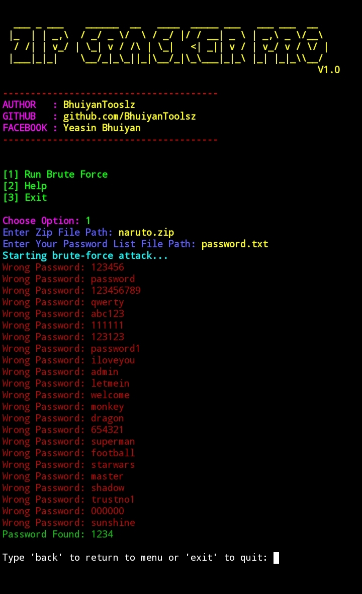

# ZipCrackerPro

<h1 align="center">ZIP CRACKER PRO</h1>

  
  
  
  

---

<h2>Features</h2>
<ul style="color: green;">
  <li>Simple and user-friendly terminal interface.</li>
  <li>Supports brute-force attack on ZIP file passwords.</li>
  <li>Accepts custom ZIP file paths for flexibility.</li>
  <li>Uses password list files to try multiple passwords.</li>
  <li>Color-coded terminal output for easy readability.</li>
  <li>Clear success and error messages.</li>
  <li>Post-action menu to return or exit after each operation.</li>
  <li>Lightweight and runs on any system with Python and zipfile module.</li>
  <li>Includes helpful instructions and warnings.</li>
  <li>Open-source and easy to modify.</li>
</ul>

<h2>📥 Installation</h2>

<strong>Just copy and paste the commands below 👇</strong>

<pre style="background:#f4f4f4; padding:10px; border:1px solid #ccc;"><code>
pkg update && pkg upgrade
pkg install python
pkg install git
pkg install python git -y
https://github.com/BhuiyanToolsZ/ZipCrackerPro.git
cd ZipCrackerPro
python ZipCrackerPro.py
</code></pre>

<h2 style="color:purple;">Usage</h2>
<ul>
<li>Run the tool with <code>python ZipCrackerPro.py</code></li>
<li>Choose option <strong>1</strong> to start brute force</li>
<li>Enter target Valid path  <code></code></li>
<li>Enter password.txt or your txt file</li>
<li>Use <strong>Ctrl + Z</strong> to stop anytime</li>
<li>Choose option <strong>3</strong> to exit the tool</li>
</ul>

<h2 style="color:darkred;">Important Notes</h2>
<ul>
  <li>This tool is designed for educational and authorized use only.</li>
  <li>Use ZipCrackerPro <strong>only on ZIP files you own or have explicit permission to test.</strong></li>
  <li>Unauthorized access or cracking into files without permission is illegal and unethical.</li>
  <li>Make sure your password list file contains one password per line in plain text.</li>
  <li>Large password lists may take significant time to process; be patient.</li>
  <li>This tool uses Python’s built-in <code>zipfile</code> module and may not work with all types of encrypted ZIP files.</li>
  <li>Running the tool on very large ZIP files or corrupted archives might cause errors.</li>
  <li>Always backup your ZIP files before attempting any brute-force operation.</li>
  <li>If you encounter any errors, verify file paths and file permissions.</li>
  <li>The developer is not responsible for any misuse of this tool.</li>
</ul>

  ⚠️This tool is made for educational purposes only.
Do not use it for illegal activities.
You are fully responsible for your own actions while using this tool.
Developer is not responsible for any kind of misuse or damage.
<h2 align="center">🙋‍♂️ Developer Info</h2>

  
  
  
  
  
   

</html>
